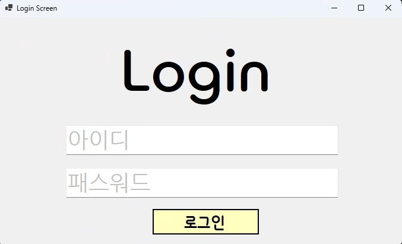
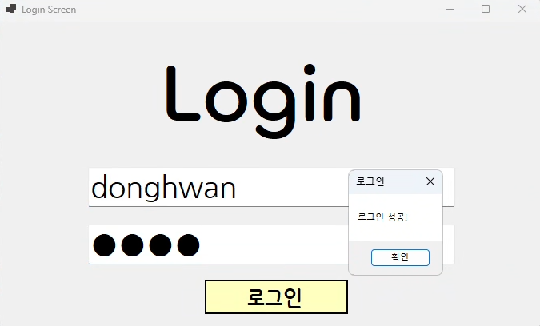
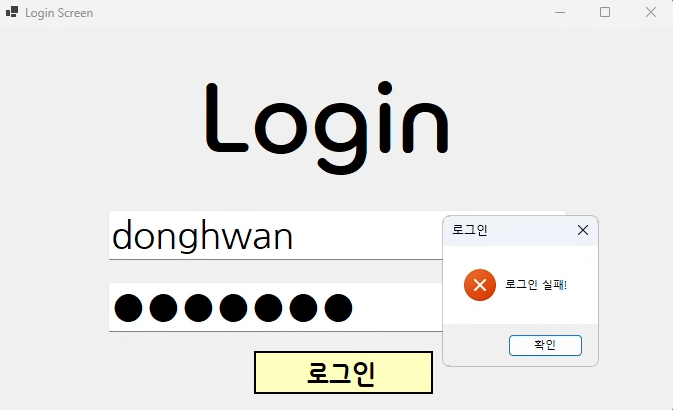
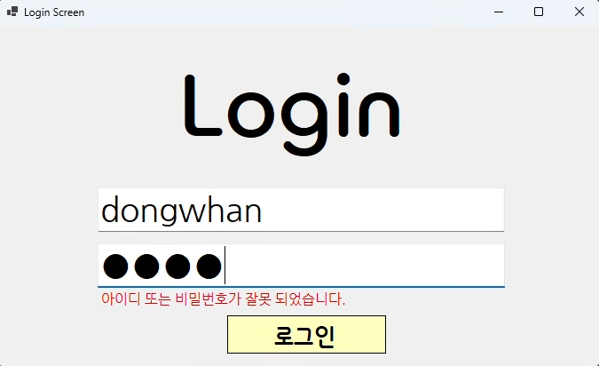
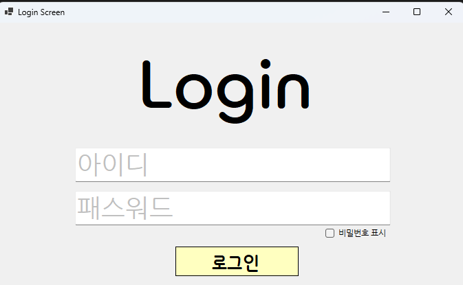
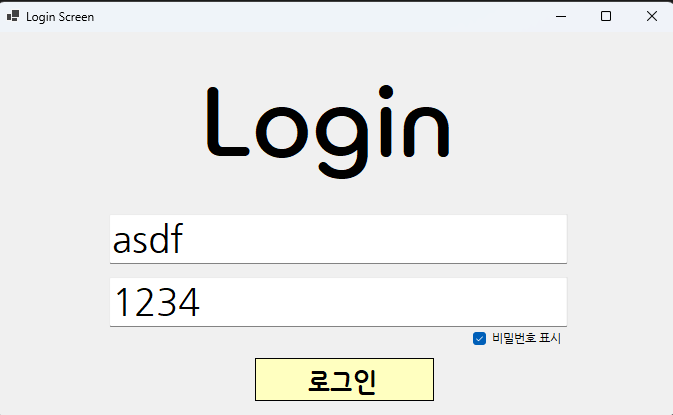
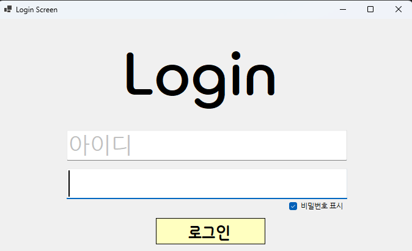
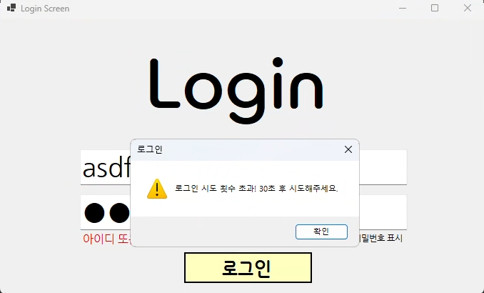
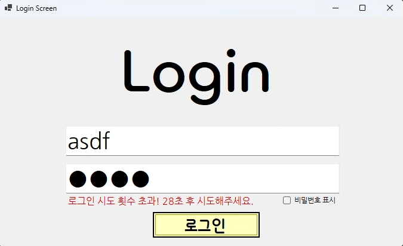

# (C# 코딩) 로그인 화면

## 개요
- C# 프로그래밍 학습
- 1줄 소개: 간단한 로그인 화면을 구현한 애플리케이션
- 사용한 플랫폼:
  - C#, .NET Windows Forms, Visual Studio, GitHub
- 사용한 컨트롤:
  	- Label 컨트롤: 텍스트를 표시하는 데 사용
    - TextBox 컨트롤: 사용자 입력을 받는 데 사용
    - Button 컨트롤: 사용자가 클릭하여 로그인 시도를 하는 데 사용
- 사용한 기술과 구현한 기능:
    - Placeholder 기능: TextBox에 입력 힌트를 표시하여 사용자에게 입력 안내
    - 로그인 유효성 검사: 입력된 아이디와 패스워드가 올바른지 확인하는 기능
    - 에러 메시지 표시: 로그인 실패 시 사용자에게 에러 메시지를 보여주는 기능
    - 입력 초기화 기능: Escape 키를 눌러 입력창을 초기화하는 기능
    - 패스워드 표시 기능: 체크박스를 통해 패스워드 입력란의 텍스트를 보이거나 숨기는 기능
# 각 과제별 실행 화면

## 실행 화면 (과제1)

- 과제 내용
    - 컨트롤 배치와 기본적인 속성 설정
    - Placeholder로 입력창 안내하는 기능 구현
    - 아이디와 패스워드 처리 기능 구현

- 구현 내용과 기능 설명
    - TextBox, Button 등을 적절히 배치하여 로그인 화면을 구성
    - 아이디와 패스워드 입력 힌트를 회색으로 표시하는 Placeholder 구현
    - 로그인 가능 여부 체크 기능 구현

## 실행 화면 (과제2)

- 과제 내용
    - 아이디 또는 패스워드가 잘못 입력되었을 때 에러 메시지 보여주기
    - MessageBox를 띄우지 말고 아이디와 패스워드를 입력하는 곳에 보여주기
  
- 구현 내용과 기능 설명
    - Label 컨트롤을 추가하여 로그인 실패 시 에러 메시지를 표시
    - Visible 속성을 이용해서 메시지 보이기와 숨기기 기능 구현
    - 엔터키를 통해 다음으로 이동하거나 로그인 시도할 수 있도록 설정

## 실행 화면 (과제3)

- 과제 내용
    - 사용하기 편하게 만들기
    - 전체를 지우는 기능 구현
    - 패스워드를 보여주는 기능 구현
  
- 구현 내용과 기능 설명
    - Escape 키를 누르면 현재 입력창이 초기화되는 기능 구현
    - Escape 키를 두 번 누르면 전체 입력창이 초기화되는 기능 구현
    - 체크박스를 추가하여 패스워드 입력란의 텍스트를 보이거나 숨기는 기능 구현

## 실행 화면 (과제4)

- 과제 내용
    - 아이디와 패스워드 입력 문자 확인
    - 로그인 시도 회수 제한 (2단계 확인 절차 추가)
  
- 구현 내용과 기능 설명
      - 아이디와 패스워드 입력 시 REGEX를 활용하여 입력된 문자열이 유효한지 확인
      - 로그인 시도 횟수를 카운트하여 5회 이상 실패 시 로그인 버튼을 비활성화하는 기능 구현
      - 로그인 비활성화 시 남은 시간을 표시하는 기능 구현

